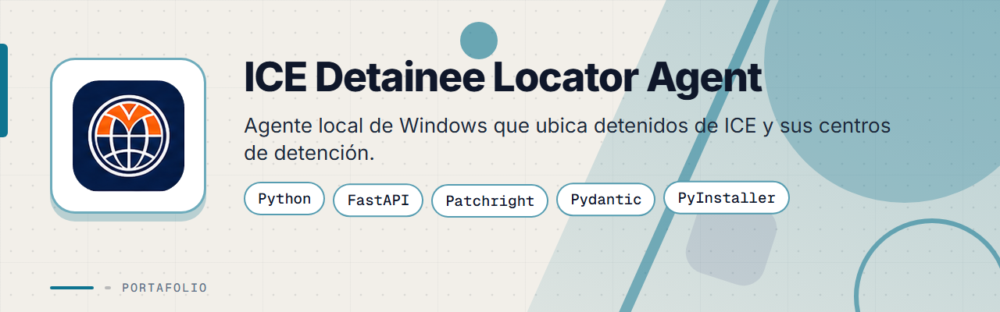
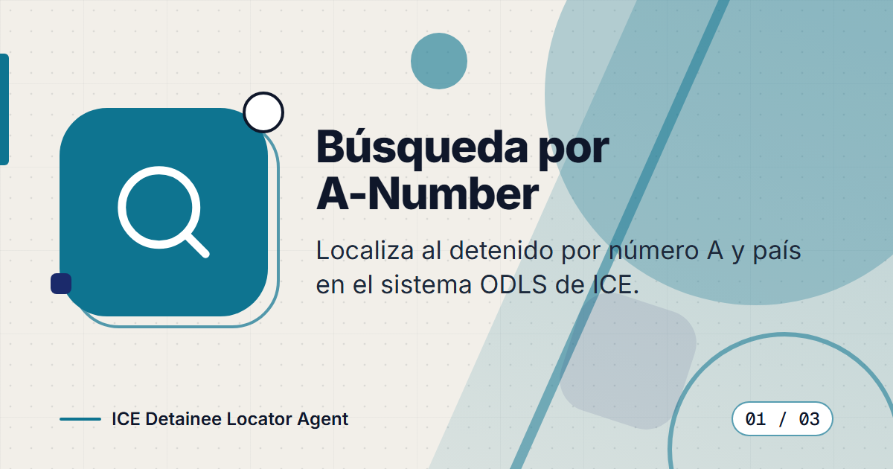
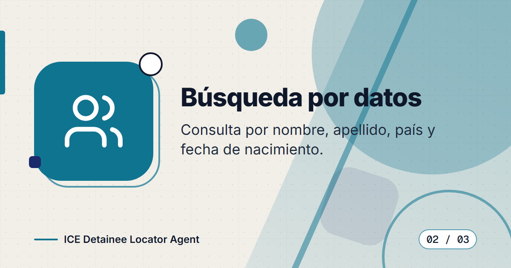
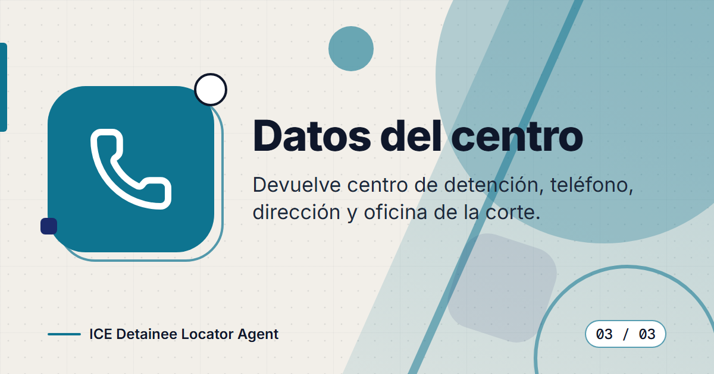
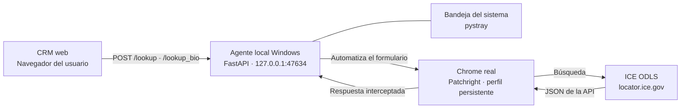

# ICE Detainee Locator Agent

**Agente local para Windows que consulta el Localizador de Detenidos en Línea de ICE (ODLS) y devuelve el centro de detención, su teléfono, su dirección y la oficina de la corte, a través de una API REST local.**

> Este es un **portafolio showcase**: el código fuente es propietario y no está incluido.

---

## Contenido

- [El Problema](#el-problema)
- [La Solución](#la-solución)
- [Funcionalidades](#funcionalidades)
- [Vista Previa](#vista-previa)
- [Arquitectura](#arquitectura)
- [Stack Tecnológico](#stack-tecnológico)
- [Instalación local](#instalación-local)
- [Roadmap](#roadmap)
- [Contacto](#contacto)

---

## El Problema

El personal de un despacho legal de inmigración necesitaba ubicar a personas detenidas por ICE sin salir de su CRM, pero el portal público de ICE:

- Está protegido por Google reCAPTCHA v3 y por un sistema anti-bots, de modo que los scripts en servidores en la nube son bloqueados.
- Exige códigos de país internos (por ejemplo `GUATE` o `MEXIC`) en lugar de nombres comunes.
- Obliga a repetir la búsqueda manualmente, y los datos útiles (teléfono, dirección, oficina de la corte) quedan dispersos.

---

## La Solución

Un agente que corre en segundo plano en el propio equipo del usuario, con un icono en la bandeja del sistema. Expone una API REST solo en `127.0.0.1`, de modo que las consultas salen desde la IP y el perfil de Chrome reales de la persona, y el CRM web las invoca directamente desde el navegador. El agente normaliza la entrada, consulta el ODLS y devuelve una respuesta estructurada con un estado claro.

---

## Funcionalidades

| Funcionalidad | Descripción |
|---------------|-------------|
| Búsqueda por número A | Localiza al detenido a partir del número A y el país |
| Búsqueda por datos personales | Consulta por nombre, apellido, país y fecha de nacimiento (acepta `YYYY-MM-DD`, `MM/DD/YYYY`, `YYYYMMDD` o año, mes y día por separado) |
| Datos del centro | Devuelve centro de detención, sitio web, foto, teléfono, dirección y oficina de control de expedientes de la corte |
| Normalización de países | Convierte nombres y formatos compuestos como `Guatemala(GUATE)` a los códigos internos de ICE |
| Chrome real con perfil persistente | Usa el Chrome instalado con un perfil propio, sin ventana visible para el usuario |
| Lectura directa de la API | Captura la respuesta JSON del servicio de ICE en lugar de leer tablas de la página |
| Control de ritmo | Un solo hilo de consulta a la vez y una pausa mínima de 5 segundos entre búsquedas |
| Estados explícitos | `found`, `not_found`, `invalid_country`, `invalid_input`, `captcha_blocked` y `upstream_error` |
| Seguridad local | CORS restringido al CRM y a orígenes locales, soporte de Private Network Access y una sola instancia en ejecución |
| Bandeja del sistema | Aviso de consentimiento inicial, estado del servicio y accesos rápidos |
| Autoinicio en Windows | Se registra para iniciar con la sesión del usuario |

---

## Vista Previa

<table>
  <tr>
    <td width="50%">
      
       <b>Búsqueda por A-Number</b>: localiza al detenido por número A y país en el sistema ODLS.
    </td>
    <td width="50%">
      
       <b>Búsqueda por datos</b>: consulta por nombre, apellido, país y fecha de nacimiento.
    </td>
  </tr>
  <tr>
    <td width="50%">
      
       <b>Datos del centro</b>: devuelve centro de detención, teléfono, dirección y oficina de la corte.
    </td>
    <td width="50%"></td>
  </tr>
</table>

---

## Arquitectura

**API REST local:** `GET /` (estado del servicio), `POST /lookup` (por número A, o por datos personales si se envían esos campos) y `POST /lookup_bio` (por datos personales).

El agente se empaqueta como un ejecutable único de Windows y se instala por usuario, sin permisos de administrador.

---

## Stack Tecnológico

| Capa | Tecnología |
|------|-----------|
| Lenguaje | Python 3.11+ |
| API local | FastAPI · Uvicorn · Starlette · Pydantic 2 |
| Automatización | Patchright (fork de Playwright) con Google Chrome |
| Escritorio | pystray · Pillow (icono en bandeja) |
| Empaquetado | PyInstaller (ejecutable de Windows) |
| Pruebas | pytest · pytest-asyncio · httpx |
| Calidad | Ruff |

---

## Instalación local

> **Aviso:** el código es privado y propietario. Estos pasos son solo para usuarios autorizados.

1. Requisitos: Windows y Google Chrome instalado.
2. Obtén el ejecutable empaquetado del agente a través del equipo responsable y ejecútalo.
3. Acepta el aviso de consentimiento inicial. El icono aparece en la bandeja del sistema.
4. El agente queda disponible en `http://127.0.0.1:47634` y se inicia automáticamente con tu sesión de Windows.

---

## Roadmap

- [ ] Consultas en lote para varias personas en una sola solicitud.
- [ ] Registro local de consultas para auditoría.
- [ ] Actualización automática del ejecutable.

---

## Contacto

El código fuente es propietario. Para consultas o propuestas, escríbeme:

[%206517--1870-25D366?style=for-the-badge&logo=whatsapp&logoColor=white)](https://wa.me/50765171870)

- Correo: [pablozam1931@gmail.com](mailto:pablozam1931@gmail.com)
- WhatsApp: [(507) 6517-1870](https://wa.me/50765171870)
- GitHub: [github.com/deadlyrat](https://github.com/deadlyrat)

---

*Parte del portafolio de [deadlyrat](https://github.com/deadlyrat)*
